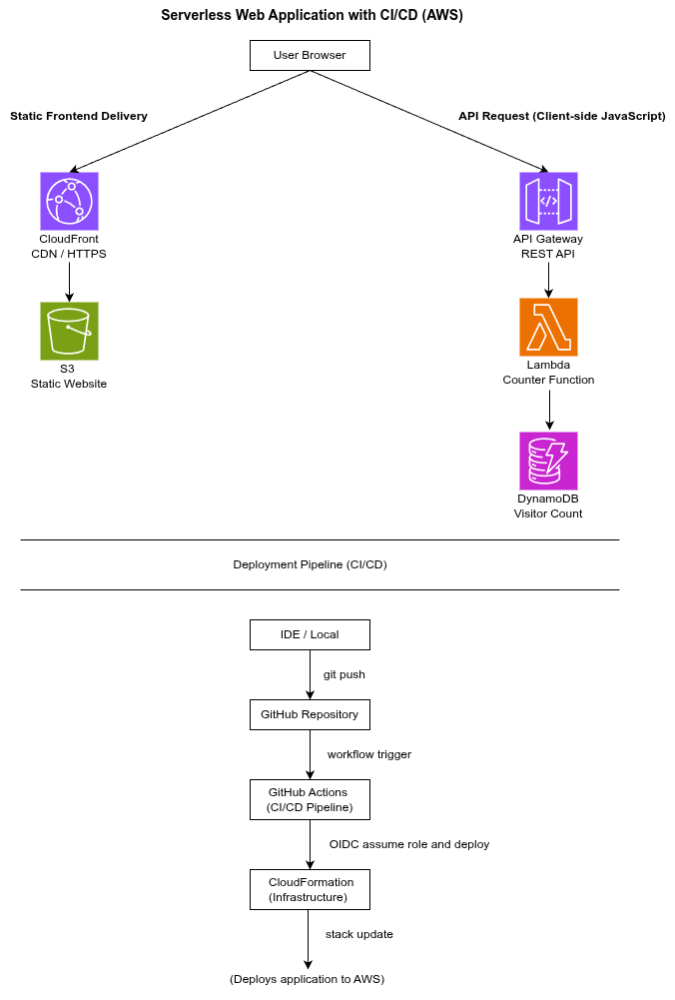

# aws-crc-clean-build

Serverless web application on AWS demonstrating Infrastructure as Code and CI/CD using CloudFormation and GitHub Actions with OIDC.

## Architecture

  

## Application Overview

This project implements a simple serverless web application on AWS.

A static frontend is delivered via Amazon CloudFront and S3.  Client-side JavaScript invokes a REST API exposed via API Gateway.  The API triggers a Lambda function which updates and retrieves a visitor count stored in DynamoDB.

Infrastructure is defined using AWS CloudFormation and deployed through a CI/CD pipeline using GitHub Actions with OIDC authentication, eliminating the need for long-lived AWS credentials.

## Key Features

- Serverless architecture using API Gateway, Lambda, and DynamoDB  
- Static frontend delivered via CloudFront and S3  
- Infrastructure as Code using CloudFormation  
- CI/CD pipeline using GitHub Actions  
- Secure deployment using OIDC (no long-lived AWS credentials)  

## Implementation Notes

This repository provides a clean, self-contained implementation of the Cloud Resume Challenge using CloudFormation and GitHub Actions with OIDC.

It demonstrates reproducible deployment of a small serverless architecture using Infrastructure as Code and CI/CD.

## CI/CD bootstrap approach

To avoid circular IAM dependencies when introducing OIDC-based deployments, the CI/CD pipeline was established using a staged bootstrap pattern.

A temporary bootstrap role with broader permissions was used only to create the initial CloudFormation stack and a new CloudFormation-managed OIDC deploy role.  Once the new role had the minimum permissions required to manage the stack, the workflow was switched to assume it and the bootstrap role was removed.

All long-term deployment permissions are therefore defined and managed exclusively through Infrastructure as Code.  CloudFormation deployments are executed using a dedicated execution role passed from GitHub Actions via `--role-arn`, enforcing a strict deploy-role → execution-role control-plane boundary and avoiding IAM self-mutation.

## Scope (intentional)

- Single environment  
- Infrastructure as Code using CloudFormation  
- CI/CD via GitHub Actions with OIDC  
- Short-lived credentials only  
- Safe destroy-and-rebuild workflow  

## Out of scope

- Reuse of existing production resources  
- Multi-environment deployment  
- Feature parity with the live site  
- Advanced security hardening or optimisation  

## Current status

See `STATUS.md` for the stack’s current deployment state and known limitations.

## Notes

This repository is a demonstration created for learning and assessment purposes.  It prioritises clarity, safety, and reproducibility over completeness.
